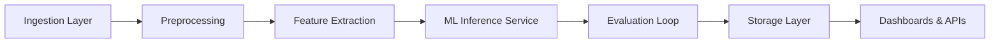
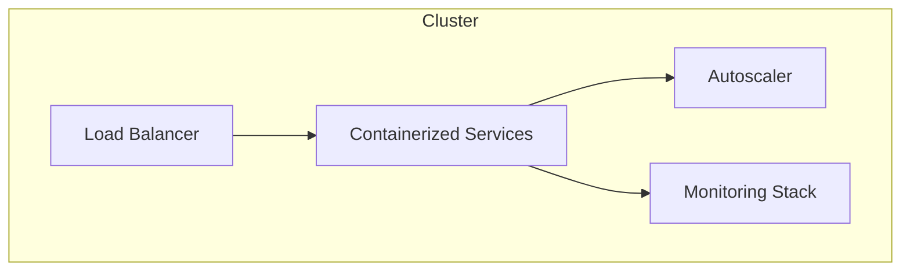

<!--
HYBRID FORMAT NOTES
- Slides are clean for Cursor slide generation
- STAR + RADIO cues included in HTML comments
- Speaker Notes placeholders included for Cursor to auto-fill
- Pacing target: ~40 minutes
-->

# High‑Reliability Real‑Time System Design

### Columbia TikTok ML Pipeline + Social‑Order Commerce Pipeline

Buck — Senior Full Stack Engineer Candidate

---

## Slide 1 — Title

**High‑Reliability Real‑Time System Design**  
Columbia TikTok ML Pipeline + Social‑Order Commerce Pipeline  
Buck — Senior Full Stack Engineer Candidate

<!-- STAR: S — Introduce the situation -->
<!-- RADIO: R — Problem framing -->
<!-- Pacing: 2 minutes -->

---

## Slide 2 — Problem Domain (ML Pipeline)

The Columbia ML project required extracting meaningful signals from **high‑volume, noisy, user‑generated video data** in real time.

**Objectives**

- Build a reliable ingestion + processing pipeline
- Deliver low‑latency insights
- Maintain predictable behavior under inconsistent inputs

<!-- STAR: S -->
<!-- RADIO: R -->
<!-- Pacing: 2 minutes -->

---

## Slide 3 — Why This System Mattered

- Supported research + operational decision‑making
- Required production‑grade reliability
- Needed to scale across unpredictable traffic patterns
- Had real stakeholders and real deadlines

<!-- STAR: S -->
<!-- RADIO: R -->
<!-- Pacing: 2 minutes -->

---

## Slide 4 — ML Architecture Overview



<!-- STAR: T -->
<!-- RADIO: A -->
<!-- Pacing: 2 minutes -->

---

## Slide 5 — Frontend Overview (ML Dashboard)

- React‑based operator dashboard
- Real‑time metrics + system health
- Visualization of ingestion rates, model outputs, and drift
- Designed for clarity under noisy conditions

<!-- STAR: A -->
<!-- RADIO: I -->
<!-- Pacing: 1 minute -->

---

## Slide 6 — Backend Overview (ML Pipeline)

- Async service architecture
- Event‑driven processing
- Queue‑based ingestion
- Stateless inference services

<!-- STAR: A -->
<!-- RADIO: A/I -->
<!-- Pacing: 1 minute -->

---

## Slide 7 — Data & Storage (ML Pipeline)

- Raw data store
- Feature store
- Model output store
- Metadata + observability tables
- Versioned schemas + validation gates

<!-- STAR: A -->
<!-- RADIO: D -->
<!-- Pacing: 2 minutes -->

---

## Slide 8 — Communication Protocols (ML Pipeline)

- REST APIs
- Internal gRPC‑style boundaries
- Queue‑based ingestion
- WebSockets for real‑time UI updates

<!-- STAR: A -->
<!-- RADIO: I -->
<!-- Pacing: 1 minute -->

---

## Slide 9 — Deployment Model (ML Pipeline)



- Containerized services
- Horizontal scaling
- Canary deployments
- Automated rollback paths

<!-- STAR: A -->
<!-- RADIO: O -->
<!-- Pacing: 2 minutes -->

---

# SECOND CASE STUDY — SOCIAL‑ORDER COMMERCE PIPELINE

---

## Slide 10 — Requirements (Social‑Order Pipeline)

**Functional Requirements**

- Ingest TikTok Shop orders via **Rithum posting to Function App webhook endpoints**
- Normalize into **canonical formats** for SFCC/SFOMS/SAP
- Maintain **order provenance** end‑to‑end
- Support **bidirectional** status updates
- Authenticate via **APIM**
- Use **Azure Service Bus** for downstream + upstream flows
- Integrate via **custom SFCC cartridge**

**Non‑Functional Requirements**

- Reliability, observability, maintainability
- Scalability under TikTok traffic spikes
- Auditability across all systems

<!-- STAR: S -->
<!-- RADIO: R -->
<!-- Pacing: 2 minutes -->

---

## Slide 11 — Why Rithum Won (Decision Architecture)

We evaluated two options:

**Direct SFCC → TikTok API**

- Fragile
- High maintenance
- No canonical schema
- No retries/backoff
- Tight coupling

**Rithum Middleware**

- Better pricing
- Canonical order schema
- Built‑in retries + DLQs
- Future‑proof (Instagram, YouTube, etc.)
- Versioned API contracts
- ADR‑documented decision

<!-- STAR: T/A -->
<!-- RADIO: I -->
<!-- Pacing: 3 minutes -->

---

## Slide 12 — Social‑Order Architecture Diagram

```mermaid
flowchart LR
    TT[TikTok Shop Webhooks] --> R[Rithum Middleware]
    R --> APIM[Azure API Management]
    APIM --> AF[Azure Function App (Stateless)]
    AF --> SB1[Azure Service Bus (Downstream)]
    SB1 --> CM[Canonical Mapping Layer]
    CM --> CART[Custom SFCC Cartridge]
    CART --> SFCC[Salesforce Commerce Cloud]
    SFCC --> SFOMS[Salesforce Order Management System]
    SFOMS --> SAP[SAP Fulfillment]

    SAP --> SB2[Azure Service Bus (Upstream)]
    SB2 --> AF2[Social-Order Function App]
    AF2 --> RAPI[Rithum API (Status Update)]

    subgraph Observability
        L[Loki (Unified Logs)]
        K[KQL (Azure Logs)]
        G[Grafana Dashboards]
        T[Traces]
    end

    AF --> L
    AF --> K
    APIM --> K
    SB1 --> L
    SB2 --> L
    SFCC --> L
    SFOMS --> L
    SAP --> L
    L --> G
    K --> G
```

<!-- STAR: A -->
<!-- RADIO: A/I -->
<!-- Pacing: 3 minutes -->

---

## Slide 13 — Downstream Order Creation

**Flow**

- Rithum posts to Function App webhook endpoints
- APIM authenticates + applies policies
- Function App validates + normalizes
- Publishes to **Azure Service Bus**
- SFCC Cartridge creates orders
- SFOMS orchestrates lifecycle
- SAP fulfills

<!-- STAR: A -->
<!-- RADIO: I -->
<!-- Pacing: 3 minutes -->

---

## Slide 14 — Upstream Status Sync

**Flow**

- SAP emits fulfillment events
- SFOMS updates lifecycle
- Events published to **Service Bus (Upstream)**
- Function App transforms + updates Rithum API

<!-- STAR: A -->
<!-- RADIO: I -->
<!-- Pacing: 3 minutes -->

---

## Slide 15 — Data: Provenance & Canonical Mapping

- Canonical schema isolates upstream volatility
- Provenance chain:
  - TikTok → Rithum → Azure → SFCC → SFOMS → SAP
- Structured logging with dot‑chaining:
  - `order.provenance.tiktok.id=...`
  - `order.sfcc.create.request=true`
  - `order.sap.fulfillment.status=created`

<!-- STAR: A -->
<!-- RADIO: D -->
<!-- Pacing: 3 minutes -->

---

## Slide 16 — Observability: Grafana + Loki + KQL

**Why Loki > KQL**

- KQL was resource‑scoped, fragmented
- Hard to correlate cross‑system events
- Loki unified logs across all Azure projects
- Grafana dashboards gave a single pane of glass
- Structured logging enabled provenance queries

<!-- STAR: A -->
<!-- RADIO: O -->
<!-- Pacing: 3 minutes -->

---

## Slide 17 — Fault Tolerance & Reliability

- Retry + backoff
- Dead‑letter queues
- Idempotent order creation
- Health checks + circuit breakers
- Autoscaling

<!-- STAR: A -->
<!-- RADIO: O -->
<!-- Pacing: 2 minutes -->

---

## Slide 18 — Deployment Model (Commerce)

- Stateless Azure Functions
- APIM as secure boundary
- Canary deployments
- Automated rollback

<!-- STAR: A -->
<!-- RADIO: O -->
<!-- Pacing: 2 minutes -->

---

## Slide 19 — Cross‑Functional Integration

- Worked with commerce, SAP, SFCC, and Rithum teams
- Managed API contracts
- Ensured version control + reproducibility

<!-- STAR: A -->
<!-- RADIO: I -->
<!-- Pacing: 1 minute -->

---

## Slide 20 — Key Trade‑Offs

- Latency vs accuracy
- Batch vs streaming
- Coupling vs maintainability
- Observability cost vs depth

<!-- STAR: A -->
<!-- RADIO: Summary -->
<!-- Pacing: 2 minutes -->

---

## Slide 21 — Impact

- Reliable, scalable, future‑proof pipeline
- Full provenance from TikTok → SAP → TikTok
- Faster debugging via Loki
- Reduced operational overhead
- Enabled new social channels with minimal work

<!-- STAR: R -->
<!-- RADIO: O -->
<!-- Pacing: 3 minutes -->

---

## Slide 22 — Why This Maps to Echodyne

This work demonstrates:

- End‑to‑end system design
- Async pipelines
- Real‑time reliability
- Observability + provenance
- Cross‑system integration
- Architectural judgment

<!-- STAR: R -->
<!-- RADIO: Summary -->
<!-- Pacing: 2 minutes -->

---

## Slide 23 — Closing

I build systems that perform under real‑world constraints.  
I’d bring the same rigor, clarity, and reliability to Echodyne’s radar software platform.

<!-- STAR: R -->
<!-- Pacing: 1 minute -->

---

# END OF DECK
