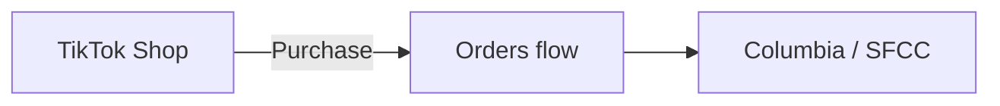
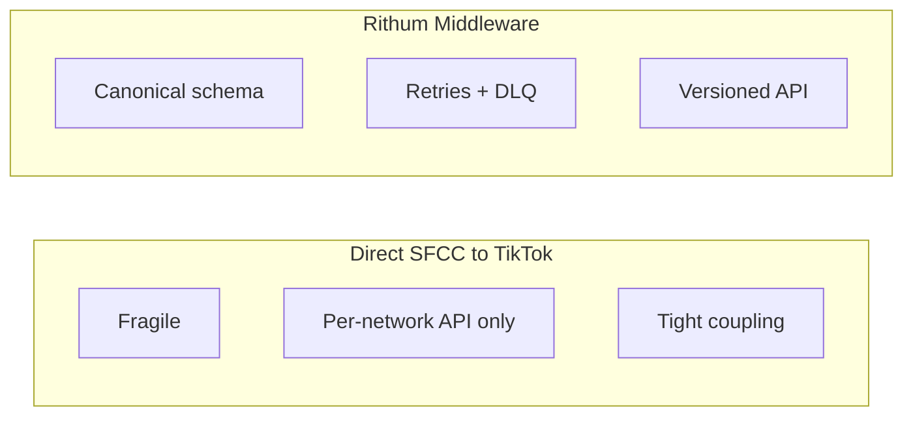
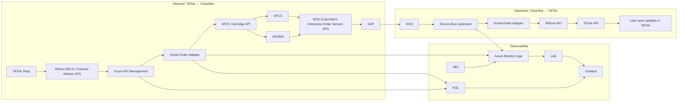
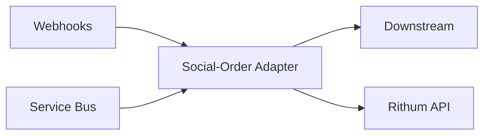
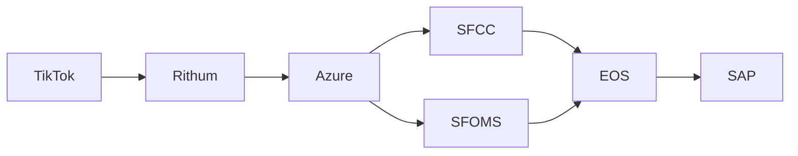
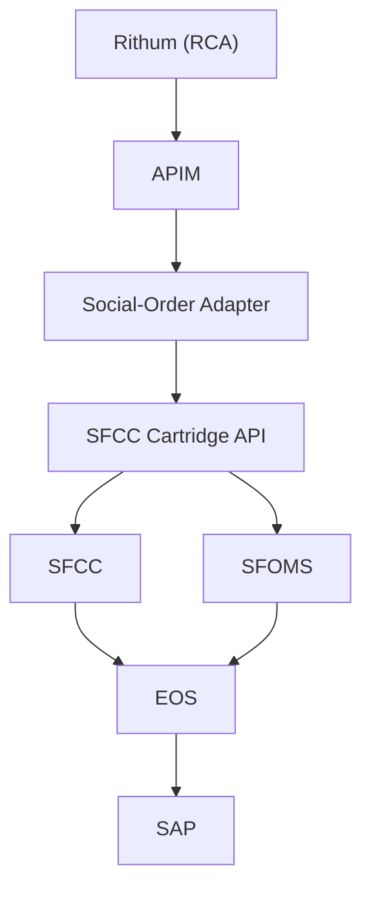
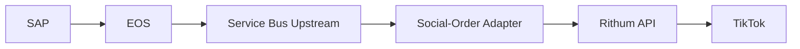
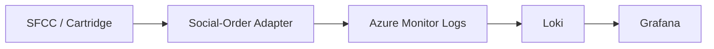
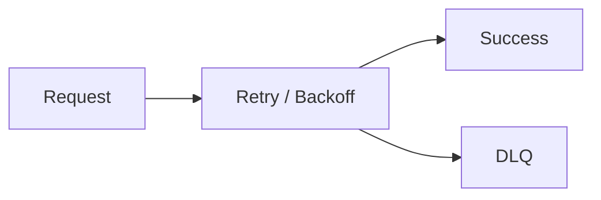
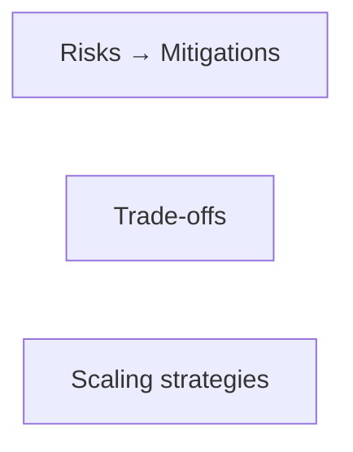

<!--
HYBRID FORMAT NOTES
- Slides are clean for Cursor slide generation
- System design follows RADIO: Requirements → Architecture → Data model → Interface (API) → Optimizations
- STAR story arc: Situation → Task → Action → Result (for narrative flow)
- Pacing target: 30–40 minutes presentation + Q&A
-->

# Social-Order Adapter

## High‑Reliability Real‑Time System Design

### Client: Columbia Sportswear

### Project: Social‑Order Adapter

###

#### Brandon Pliska — Senior Full Stack Engineer Candidate

---

## Slide 2 — Presentation Structure (RADIO)

The **system design** follows the [RADIO framework](https://www.greatfrontend.com/front-end-system-design-playbook/framework):

- **R**equirements — Problem scope, functional & non-functional requirements, core use cases.
- **A**rchitecture — Key components (Rithum, APIM, Adapter, Service Bus, SFCC/SFOMS, EOS, SAP) and how they relate.
- **D**ata model — Core entities, canonical schema, provenance chain, and where data lives.
- **I**nterface (API) — Webhooks, Service Bus contracts, and APIs between components (parameters, responses).
- **O**ptimizations — Scaling, observability, fault tolerance, security, and trade-offs.

We’ll also cover team leadership, delivery, and outcomes (STAR: Situation → Task → Action → Result).

<!-- RADIO: Framework overview -->
<!-- Pacing: 1 minute -->

---

## Slide 3 – Problem Domain & Objectives (RADIO: R — Requirements)

Columbia’s directive was to support **multiple social networks** for in-app commerce; [TikTok](copilot-action://composer-send?text=What%20is%20TikTok%20Shop) Shop was the **first**. Customers would purchase inside each platform (e.g. TikTok) using their existing accounts, and those orders had to flow reliably into Columbia’s [SFCC backend](copilot-action://composer-send?text=Explain%20Salesforce%20Commerce%20Cloud%20order%20flows).

### Objectives

- **[Build a robust ingestion + processing pipeline](copilot-action://composer-send?text=How%20do%20you%20design%20a%20robust%20ingestion%20pipeline%3F)**  
  Normalize TikTok Shop order data and handle bursty, inconsistent payloads without breaking downstream systems.

- **[Deliver timely, actionable order data](copilot-action://composer-send?text=What%20counts%20as%20timely%20order%20data%20for%20commerce)**  
  Ensure orders, cancellations, and updates arrive quickly enough to support fulfillment, inventory, and customer service.

- **[Maintain predictable behavior under inconsistent inputs](copilot-action://composer-send?text=How%20to%20design%20predictable%20behavior%20with%20inconsistent%20inputs)**  
  Gracefully handle malformed, partial, or delayed TikTok payloads while preserving order integrity and provenance.

<!-- STAR: S — Problem domain and objectives -->
<!-- Pacing: 2 minutes -->

---

## Slide 4 — Requirements (RADIO: R — Functional & Non-Functional)

**Functional Requirements**

- Ingest TikTok Shop orders via **Rithum (RCA) posting to Social-Order Adapter webhook endpoints** (e.g. order payment cleared); adapter maps to canonical/SFCC format and calls **SFCC Cartridge API** to create orders
- Normalize into **canonical formats** for SFCC/SFOMS, **EOS (Enterprise Order Service — Columbia’s order API)**, and SAP — **SFCC** and **SFOMS** are two systems in the same suite that work together; they pass orders into **EOS**, which orchestrates lifecycle (New → Authorized → Confirmed → Shipped → Fulfilled) and sends to SAP
- Maintain **order provenance** end‑to‑end
- Support **bidirectional** status updates (webhooks: Rithum → Adapter → SFCC/EOS; upstream: EOS → Service Bus → Adapter → Rithum API)
- Authenticate via **APIM**
- Use **Azure Service Bus** for upstream status sync (EOS → Adapter → Rithum) and optionally for audit/tracking
- Integrate via **custom SFCC cartridge** (API for order creation)

**Non‑Functional Requirements**

- Reliability, observability, maintainability
- Scalability under TikTok traffic spikes
- Auditability across all systems

<!-- STAR: T — Requirements and constraints -->
<!-- Pacing: 2 minutes -->

---

## Slide 5 — Key Technology Decision: Why Rithum (RADIO: R → A)

We evaluated two options:

**Direct SFCC → TikTok API**

- Fragile
- High maintenance
- TikTok has a **specific API format** — we’d support it (and each future network) directly; no single canonical schema across social platforms
- No retries/backoff
- Tight coupling

**Rithum Middleware**

- Better pricing
- **Canonical order schema** — one model for TikTok and future networks (Instagram, YouTube, etc.)
- Built‑in retries + DLQs
- Future‑proof (Instagram, YouTube, etc.)
- Versioned API contracts
- ADR‑documented decision

<!-- STAR: T/A — Key technology decisions and rationales -->
<!-- Pacing: 3 minutes -->

---

## Slide 6 — High‑Level Architecture (RADIO: A — Architecture)

<!-- STAR: A — System architecture and design choices -->
<!-- Pacing: 3 minutes -->

---

## Slide 7 — Backend, Scaling & Deployment (RADIO: A — Architecture)

**Auto-Scaling**

- Azure Function Apps **scale automatically** with incoming load, so the pipeline handles TikTok traffic spikes without over-provisioning.

**Social-Order Adapter (single Function App)**

The adapter controls **downstream** (Rithum → Columbia) and **upstream** (Columbia → Rithum) flows between Rithum and Columbia.

- **APIM-secured webhook endpoints** — Rithum (RCA) posts order and status payloads here; adapter creates orders in SFCC via Cartridge API and updates status in EOS; APIM handles auth and policy.
- **Service Bus triggers** — **EOS** (or SAP) lifecycle and fulfillment events are published to Service Bus; the same Function App consumes them and calls back to the **Rithum API** so Rithum stays in sync with Columbia’s fulfillment state.

Result: one adapter that ingests from Rithum (webhooks) and pushes status back to Rithum (Service Bus → Rithum API), with automatic scale for both webhook and Service Bus traffic.

<!-- STAR: A — Scaling strategy; deployment model -->
<!-- Pacing: 2–3 minutes -->

---

## Slide 8 — Data Model: Provenance & Canonical Mapping (RADIO: D)

- **Canonical schema** — Core entities (order, line items, status) normalized for SFCC, SFOMS, **EOS**, and SAP; isolates upstream (TikTok/Rithum) volatility.
- **Provenance chain** — End-to-end ownership and audit: TikTok → Rithum → Azure → SFCC/SFOMS → **EOS (Columbia’s Enterprise Order Service API)** → SAP.
- **Structured logging** (dot‑chaining from `LogEventNames.OrderFlow`, e.g. `order.flow.*`):
  - `order.flow.webhook.paymentcleared.received`
  - `order.flow.sfcc.create.request`
  - `order.flow.enterpriseorderservice.updateordermaster.request`
  - `order.flow.servicebus.eosorderupdate.received`
  - `order.flow.rithum.updatestatus.request`

<!-- RADIO: D — Data model / core entities -->
<!-- Pacing: 3 minutes -->

---

## Slide 9 — Interface: Downstream Order Creation (RADIO: I)

**Flow**

- **Rithum** (RCA / Channel Advisor API) posts to **Social-Order Adapter** webhook endpoints (e.g. order payment cleared)
- APIM authenticates + applies policies
- Adapter validates, normalizes, and maps to SFCC format (canonical mapping in adapter); calls **SFCC Cartridge API** to create orders in **SFCC**
- **SFCC** and **SFOMS** (same suite, two systems working together) pass orders into **EOS**
- **EOS (Columbia’s Enterprise Order Service API)** receives orders from SFCC/SFOMS, orchestrates lifecycle (New → Authorized → Confirmed → Shipped → Fulfilled), and sends to **SAP** for fulfillment

**Key interfaces:** Rithum webhook (POST, order payload) → Adapter; Adapter → SFCC Cartridge API (order create request/response); SFCC/SFOMS → EOS → SAP (order lifecycle). *Service Bus is used for upstream status sync (Slide 10) and optionally for audit/tracking on the webhook path.*

<!-- RADIO: I — Interface (API) between components -->
<!-- Pacing: 3 minutes -->

---

## Slide 10 — Interface: Upstream Status Sync (RADIO: I)

**Flow**

- **EOS** holds order lifecycle state; when SAP fulfills (or cancellations/refunds occur), **EOS** is updated and lifecycle events are published to **Service Bus (Upstream)**
- **Social-Order Adapter** consumes those events, transforms status to Rithum semantics, and updates **Rithum API** so TikTok reflects current state

**Key interfaces:** EOS / SAP → Service Bus (upstream topic, status message); Service Bus → Adapter; Adapter → Rithum API (status update request/response).

<!-- RADIO: I — Interface (API) between components -->
<!-- Pacing: 3 minutes -->

---

## Slide 11 — Observability: Grafana + Loki / KQL (RADIO: O)

**Why Loki > KQL**

- KQL was resource‑scoped, fragmented
- Hard to correlate cross‑system events
- Loki unifies logs across all of Columbia (AWS, GCP, Salesforce, Azure, etc.) so we can piece together timelines and visualize an order's provenance or journey
- Grafana dashboards gave a single pane of glass
- Structured logging enabled provenance queries

**Log flow:** SFCC and downstream systems are observed via the **Social-Order Adapter**; the adapter (and Azure) emit to **Azure Monitor Logs**, which feed **Loki** for unified querying.

<!-- RADIO: O — Optimizations and deep dive -->
<!-- Pacing: 3 minutes -->

---

## Slide 12 — How We Approached Key Challenges (RADIO: O) (Action)

**Scaling** — Azure Functions auto-scale with webhook and Service Bus load; Service Bus buffers upstream (EOS → Rithum) status traffic so we don’t over-provision or drop messages.

**Data synchronization** — Bidirectional flow: Rithum → adapter → SFCC/SFOMS → EOS → SAP (orders) and EOS/SAP (lifecycle events) → Service Bus → adapter → Rithum (status). Canonical mapping and idempotent order creation keep systems in sync; SFCC and SFOMS (same suite) pass orders into EOS; EOS is the order-lifecycle authority into SAP; provenance chain supports reconciliation.

**Security** — APIM as single secure boundary; auth and policy at the edge; no raw TikTok credentials in our stack; least-privilege for adapter → Rithum and SFCC/SFOMS.

**Fault tolerance** — Retry + exponential backoff; dead-letter queues for failed messages; idempotent order creation to avoid duplicates; health checks and circuit breakers; stateless functions so failures don’t leave bad in-memory state.

<!-- STAR: A — Scaling, data sync, security, fault tolerance per prompt -->
<!-- Pacing: 3 minutes -->

---

## Slide 13 — Deployment Model (RADIO: O)

- **Stateless Azure Functions** — Scale out without session affinity; safe horizontal scaling.
- **APIM as secure boundary** — All external traffic (Rithum webhooks) through APIM; auth and policy in one place.
- **Canary deployments** — Roll out adapter changes to a subset before full rollout.
- **Automated rollback** — On failure or regression, roll back to last known good release.

<!-- STAR: A — Deployment model -->
<!-- Pacing: 2 minutes -->

---

## Slide 14 — Cross‑Functional Integration (RADIO: I + O)

- **Authentication** — APIM as secure boundary; API keys and policies for Rithum webhooks; no customer SSO in this pipeline (TikTok/Columbia handle identity).
- **APIs** — Versioned Rithum webhook and Rithum API contracts; SFCC cartridge API; clear request/response and error contracts.
- **Version control & reproducibility** — Cartridge and adapter in Git; ADRs for major decisions; release tags and deployment automation.
- **Data consistency** — Canonical mapping, idempotent order creation, and provenance chain so we can reconcile and debug across systems.
- **Observability** — Unified logs (Loki), Grafana dashboards, structured logging; correlation IDs across Rithum → Azure → SFCC/SFOMS → EOS → SAP.
- **External systems** — Rithum (orders, status), TikTok (source of truth for shop), **SFCC and SFOMS** (same suite, two systems; order creation and handoff), **EOS (Columbia’s Enterprise Order Service API, order lifecycle and status)**, SAP (fulfillment). No file storage or push notifications in this flow; order/status flow only.

<!-- STAR: A — Cross-functional integration per prompt -->
<!-- Pacing: 3 minutes -->

---

## Slide 15 — Team Leadership & Delivery (Action)

- **Guiding design decisions** — Led choice of Rithum over direct TikTok integration; drove canonical schema and single adapter for both downstream and upstream flows.
- **Managing trade-offs** — Documented ADRs (e.g. Rithum vs direct); balanced latency vs consistency and observability cost vs depth with stakeholders.
- **Leading implementation** — Owned adapter and cartridge design; coordinated with commerce, SAP, SFCC/SFOMS, and Rithum teams on contracts and rollout.
- **Delivery approach** — Iterative delivery with clear milestones; canary deployments and rollback so we could ship without blocking fulfillment.

<!-- STAR: A — Team leadership and delivery per prompt -->
<!-- Pacing: 3 minutes -->

---

## Slide 16 — Risks, Trade‑Offs & Scaling Strategies (RADIO: O)

**Risks & mitigations**

- **Rithum or TikTok API changes** — Versioned contracts, adapter abstraction, and monitoring for contract drift.
- **Peak load / bursty traffic** — Auto-scaling Azure Functions, Service Bus for buffering, DLQs for failed messages.
- **Data inconsistency across systems** — Idempotency, provenance, and structured logging for audit and reconciliation.

**Trade-offs**

- **Latency vs accuracy** — Accept short delay for normalized, validated orders rather than pushing raw payloads straight to SFCC.
- **Batch vs streaming** — Event-driven streaming (webhooks + Service Bus) for timeliness; no batch ETL in the hot path.
- **Coupling vs maintainability** — Single canonical schema and one adapter to reduce per-network coupling while keeping the system maintainable.
- **Observability cost vs depth** — Structured logs and Loki for depth; careful retention and sampling to control cost.

**Scaling strategies**

- **Horizontal scaling** — Stateless Azure Functions scale out with webhook and Service Bus load.
- **Message buffering** — Service Bus absorbs spikes; retries and DLQs prevent loss and allow replay.
- **Future channels** — Rithum’s canonical model means new social channels (e.g. Instagram) plug in with minimal adapter change.

<!-- STAR: A — Risks, trade-offs, scaling per prompt -->
<!-- Pacing: 4 minutes -->

---

## Slide 17 — Impact & Reflections (Result)

- **Technical impact** — Reliable, scalable adapter pipeline; full order provenance TikTok → SAP → TikTok; faster debugging via Loki; reduced operational overhead.
- **Organizational impact** — New social channels (e.g. Instagram) can be added with minimal work; clearer ownership between Columbia, Rithum, SFCC/SFOMS, and SAP.
- **Reflections** — Canonical schema and one adapter paid off for maintainability; investing in observability early made incidents and contract issues easier to diagnose.

<!-- STAR: R — Technical and organizational impact; reflections -->
<!-- Pacing: 3 minutes -->

---

## Slide 18 — Closing

I build systems that perform under real‑world constraints.  
I'd bring the same rigor, clarity, and reliability to Echodyne's radar software platform.

<!-- STAR: R -->
<!-- Pacing: 1 minute -->

---

## Slide 19 — Thank You

Thank you for your time and consideration.  
I look forward to the possibility of contributing to Echodyne.
