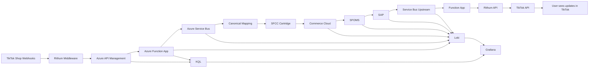

<!--
HYBRID FORMAT NOTES
- Slides are clean for Cursor slide generation
- STAR + RADIO cues included in HTML comments
- Speaker Notes placeholders included for Cursor to auto-fill
- Pacing target: ~40 minutes
-->

# Social-Order

## High‑Reliability Real‑Time System Design

### Columbia Social‑Order Commerce Pipeline

### Brandon Pliska — Senior Full Stack Engineer Candidate

---

## Slide 1 — Welcome

**High‑Reliability Real‑Time System Design**  
Columbia Social‑Order Commerce Pipeline  
Brandon Pliska — Senior Full Stack Engineer Candidate

<!-- STAR: S — Introduce the situation -->
<!-- RADIO: R — Problem framing -->
<!-- Pacing: 2 minutes -->

---

## Slide 2 – Problem Framing

Columbia wanted customers to purchase products directly inside [TikTok](copilot-action://composer-send?text=What%20is%20TikTok%20Shop) using their existing [TikTok accounts](copilot-action://composer-send?text=How%20do%20TikTok%20accounts%20work%20for%20commerce), and needed those orders to flow reliably into their [SFCC backend](copilot-action://composer-send?text=Explain%20Salesforce%20Commerce%20Cloud%20order%20flows).

### Objectives

- **[Build a robust ingestion + processing pipeline](copilot-action://composer-send?text=How%20do%20you%20design%20a%20robust%20ingestion%20pipeline%3F)**  
  Normalize TikTok Shop order data and handle bursty, inconsistent payloads without breaking downstream systems.

- **[Deliver timely, actionable order data](copilot-action://composer-send?text=What%20counts%20as%20timely%20order%20data%20for%20commerce)**  
  Ensure orders, cancellations, and updates arrive quickly enough to support fulfillment, inventory, and customer service.

- **[Maintain predictable behavior under inconsistent inputs](copilot-action://composer-send?text=How%20to%20design%20predictable%20behavior%20with%20inconsistent%20inputs)**  
  Gracefully handle malformed, partial, or delayed TikTok payloads while preserving order integrity and provenance.

<!-- STAR: S -->
<!-- RADIO: R -->
<!-- Pacing: 2 minutes -->

---

## Slide 3 — Requirements (Social‑Order Pipeline)

**Functional Requirements**

- Ingest TikTok Shop orders via **Rithum posting to Function App webhook endpoints**
- Normalize into **canonical formats** for SFCC/SFOMS/SAP
- Maintain **order provenance** end‑to‑end
- Support **bidirectional** status updates
- Authenticate via **APIM**
- Use **Azure Service Bus** for downstream + upstream flows
- Integrate via **custom SFCC cartridge**

**Non‑Functional Requirements**

- Reliability, observability, maintainability
- Scalability under TikTok traffic spikes
- Auditability across all systems

<!-- STAR: S -->
<!-- RADIO: R -->
<!-- Pacing: 2 minutes -->

---

## Slide 4 — Why Rithum Won (Decision Architecture)

We evaluated two options:

**Direct SFCC → TikTok API**

- Fragile
- High maintenance
- No canonical schema
- No retries/backoff
- Tight coupling

**Rithum Middleware**

- Better pricing
- Canonical order schema
- Built‑in retries + DLQs
- Future‑proof (Instagram, YouTube, etc.)
- Versioned API contracts
- ADR‑documented decision

<!-- STAR: T/A -->
<!-- RADIO: I -->
<!-- Pacing: 3 minutes -->

---

## Slide 5 — Social‑Order Architecture Diagram

<!-- STAR: A -->
<!-- RADIO: A/I -->
<!-- Pacing: 3 minutes -->

---

## Slide 6 — Azure Function App: Auto-Scaling & Social-Order Adapter

**Auto-Scaling**

- Azure Function Apps **scale automatically** with incoming load, so the pipeline handles TikTok traffic spikes without over-provisioning.

**Social-Order Adapter (single Function App)**

- **APIM-secured webhook endpoints** — Rithum posts order and update payloads here; APIM handles auth and policy.
- **Service Bus triggers** — Downstream (e.g. SAP/SFOMS) events are published to Service Bus; the same Function App consumes them and calls back to the **Rithum API** so Rithum stays in sync with Columbia’s fulfillment state.

Result: one adapter that ingests from Rithum and pushes status back to Rithum, with automatic scale for both webhook and Service Bus traffic.

<!-- STAR: A -->
<!-- RADIO: I -->
<!-- Pacing: 2–3 minutes -->

---

## Slide 7 — Downstream Order Creation

**Flow**

- Rithum posts to Function App webhook endpoints
- APIM authenticates + applies policies
- Function App validates + normalizes
- Publishes to **Azure Service Bus**
- SFCC Cartridge creates orders
- SFOMS orchestrates lifecycle
- SAP fulfills

<!-- STAR: A -->
<!-- RADIO: I -->
<!-- Pacing: 3 minutes -->

---

## Slide 8 — Upstream Status Sync

**Flow**

- SAP emits fulfillment events
- SFOMS updates lifecycle
- Events published to **Service Bus (Upstream)**
- Function App transforms + updates Rithum API

<!-- STAR: A -->
<!-- RADIO: I -->
<!-- Pacing: 3 minutes -->

---

## Slide 9 — Data: Provenance & Canonical Mapping

- Canonical schema isolates upstream volatility
- Provenance chain:
  - TikTok → Rithum → Azure → SFCC → SFOMS → SAP
- Structured logging with dot‑chaining:
  - `order.provenance.tiktok.id=...`
  - `order.sfcc.create.request=true`
  - `order.sap.fulfillment.status=created`

<!-- STAR: A -->
<!-- RADIO: D -->
<!-- Pacing: 3 minutes -->

---

## Slide 10 — Observability: Grafana + Loki / KQL

**Why Loki > KQL**

- KQL was resource‑scoped, fragmented
- Hard to correlate cross‑system events
- Loki unifies logs across all of Columbia (AWS, GCP, Salesforce, Azure, etc.) so we can piece together timelines and visualize an order's provenance or journey
- Grafana dashboards gave a single pane of glass
- Structured logging enabled provenance queries

<!-- STAR: A -->
<!-- RADIO: O -->
<!-- Pacing: 3 minutes -->

---

## Slide 11 — Fault Tolerance & Reliability

- Retry + backoff
- Dead‑letter queues
- Idempotent order creation
- Health checks + circuit breakers
- Autoscaling

<!-- STAR: A -->
<!-- RADIO: O -->
<!-- Pacing: 2 minutes -->

---

## Slide 12 — Deployment Model (Commerce)

- Stateless Azure Functions
- APIM as secure boundary
- Canary deployments
- Automated rollback

<!-- STAR: A -->
<!-- RADIO: O -->
<!-- Pacing: 2 minutes -->

---

## Slide 13 — Cross‑Functional Integration

- Worked with commerce, SAP, SFCC, and Rithum teams
- Managed API contracts
- Ensured version control + reproducibility

<!-- STAR: A -->
<!-- RADIO: I -->
<!-- Pacing: 1 minute -->

---

## Slide 14 — Key Trade‑Offs

- Latency vs accuracy
- Batch vs streaming
- Coupling vs maintainability
- Observability cost vs depth

<!-- STAR: A -->
<!-- RADIO: Summary -->
<!-- Pacing: 2 minutes -->

---

## Slide 15 — Impact

- Reliable, scalable, future‑proof pipeline
- Full provenance from TikTok → SAP → TikTok
- Faster debugging via Loki
- Reduced operational overhead
- Enabled new social channels with minimal work

<!-- STAR: R -->
<!-- RADIO: O -->
<!-- Pacing: 3 minutes -->

---

## Slide 16 — Why This Maps to Echodyne

This work demonstrates:

- End‑to‑end system design
- Async pipelines
- Real‑time reliability
- Observability + provenance
- Cross‑system integration
- Architectural judgment

<!-- STAR: R -->
<!-- RADIO: Summary -->
<!-- Pacing: 2 minutes -->

---

## Slide 17 — Closing

I build systems that perform under real‑world constraints.  
I'd bring the same rigor, clarity, and reliability to Echodyne's radar software platform.

<!-- STAR: R -->
<!-- Pacing: 1 minute -->

---

# END OF DECK
