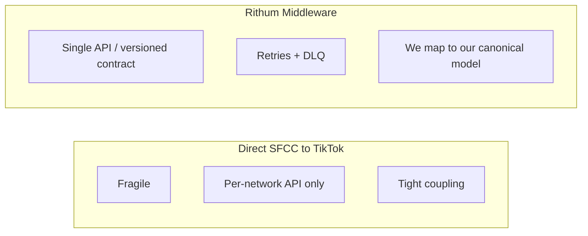
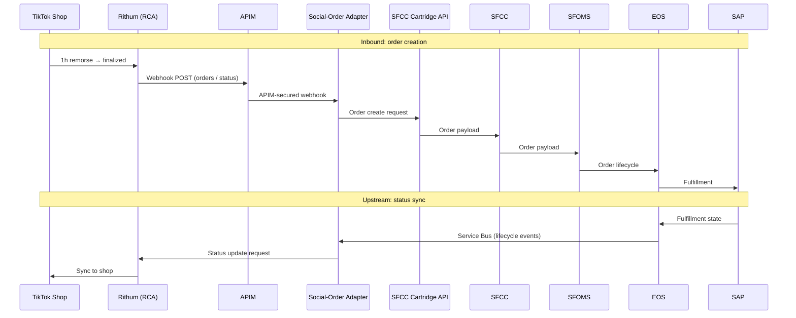
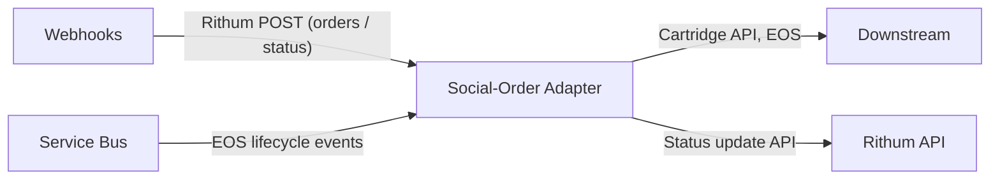
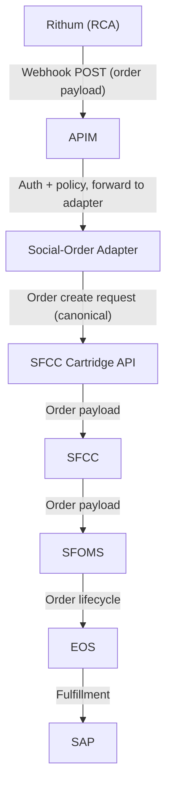
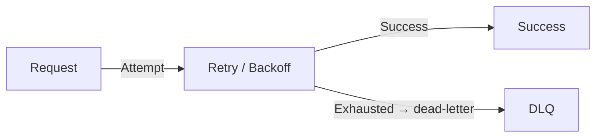
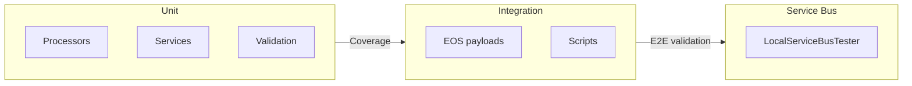
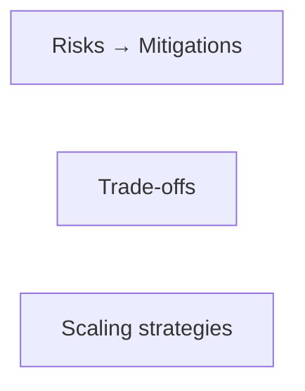

<!--
HYBRID FORMAT NOTES
- Slides are clean for Cursor slide generation
- System design follows RADIO: Requirements → Architecture → Data model → Interface (API) → Optimizations
- STAR story arc: Situation → Task → Action → Result (for narrative flow)
- Pacing target: 30–40 minutes presentation + Q&A
-->

# Social-Order Adapter

## High‑Reliability Real‑Time System Design

### Client: Columbia Sportswear

### Project: Social‑Order Adapter

###

#### Brandon Pliska — Senior Full Stack Engineer Candidate

---

## Slide 2 — Presentation Structure (RADIO + STAR)

We’ll follow **two intertwined threads**:

- **System design (RADIO)** — the [RADIO framework](https://www.greatfrontend.com/front-end-system-design-playbook/framework) structures the technical story:
  - **R**equirements — Problem scope, functional & non-functional requirements, core use cases.
  - **A**rchitecture — Key components (Rithum, APIM, Adapter, Service Bus, SFCC/SFOMS, EOS, SAP) and how they relate.
  - **D**ata model — Core entities, **our canonical data model** (Rithum as one mapped integration), provenance chain, and where data lives.
  - **I**nterface (API) — Webhooks, Service Bus contracts, and APIs between components (parameters, responses).
  - **O**ptimizations — Scaling, observability, fault tolerance, security, and trade-offs.
- **Team leadership & delivery** — how I led design decisions, coordinated across teams (commerce, SAP, SFCC/SFOMS, Rithum), and delivered safely via pipelines.
- **Outcomes & impact (STAR)** — Situation → Task → Action → Result: technical/organizational impact, risks/trade-offs, and reflections.

<!-- RADIO: Framework overview -->
<!-- Pacing: 1 minute -->

---

## Slide 3 – Problem Domain & Objectives (RADIO: R — Requirements)

Columbia’s directive was to support **multiple social networks** for in-app commerce; [TikTok](copilot-action://composer-send?text=What%20is%20TikTok%20Shop) Shop was the **first**. Customers would purchase inside each platform (e.g. TikTok) using their existing accounts, and those orders had to flow reliably into Columbia’s [SFCC backend](copilot-action://composer-send?text=Explain%20Salesforce%20Commerce%20Cloud%20order%20flows).

### Objectives

- **[Build a robust order ingestion + processing pipeline](copilot-action://composer-send?text=How%20do%20you%20design%20a%20robust%20ingestion%20pipeline%3F)**  
  Normalize TikTok Shop order data and handle bursty, inconsistent payloads without breaking downstream systems.

- **[Deliver timely, actionable order data](copilot-action://composer-send?text=What%20counts%20as%20timely%20order%20data%20for%20commerce)**  
  Ensure orders, cancellations, and updates arrive quickly enough to support fulfillment, inventory, and customer service.

- **[Maintain predictable behavior under inconsistent inputs](copilot-action://composer-send?text=How%20to%20design%20predictable%20behavior%20with%20inconsistent%20inputs)**  
  Gracefully handle malformed, partial, or delayed TikTok payloads while preserving order integrity and provenance.

<!-- STAR: S — Problem domain and objectives -->
<!-- Pacing: 2 minutes -->

---

## Slide 4 — Requirements (RADIO: R — Functional & Non-Functional)

**Functional Requirements**

- Ingest TikTok Shop orders via **Rithum (RCA) posting to Social-Order Adapter webhook endpoints** (e.g. order payment cleared); adapter maps **from Rithum’s payload** into **our canonical format** and SFCC shape, then calls **SFCC Cartridge API** to create orders
- Normalize into **our canonical format** for SFCC/SFOMS, **EOS (Enterprise Order Service — Columbia’s order API)**, and SAP — **SFCC** and **SFOMS** are two systems in the same suite that work together; they pass orders into **EOS**, which orchestrates lifecycle (New → Authorized → Confirmed → Shipped → Fulfilled) and sends to SAP
- Maintain **order provenance** end‑to‑end
- Support **bidirectional** status updates (webhooks: Rithum → Adapter → SFCC/EOS; upstream: EOS → Service Bus → Adapter → Rithum API)
- Authenticate via **APIM**
- Use **Azure Service Bus** for upstream status sync (EOS → Adapter → Rithum) and optionally for audit/tracking
- Integrate via **custom SFCC cartridge** (API for order creation)

**Non‑Functional Requirements**

- Reliability, observability, maintainability
- Scalability under TikTok traffic spikes
- Auditability across all systems

<!-- STAR: T — Requirements and constraints -->
<!-- Pacing: 2 minutes -->

---

## Slide 5 — Key Technology Decision: Why Rithum (RADIO: R → A)

We evaluated two options:

**Direct SFCC → TikTok API**

- Fragile
- High maintenance
- TikTok has a **specific API format** — we’d support it (and each future network) directly; no single canonical schema across social platforms
- No retries/backoff
- Tight coupling

**Rithum Middleware**

- Better pricing
- **Single integration point** for TikTok (and future networks); we defined **our own canonical data model** and treated Rithum’s API as an external contract — mapping layer so their schema never leaked into our domain.
- Built‑in retries + DLQs
- Future‑proof (Instagram, YouTube, etc.)
- Versioned API contracts
- ADR‑documented decision (canonical model + Rithum as integration boundary)

<!-- STAR: T/A — Key technology decisions and rationales -->
<!-- Pacing: 3 minutes -->
<!-- Interview phrasing: "We defined our own canonical data model for orders and inventory. Rithum's API schema was treated as an external contract, and we built a mapping layer so their schema never leaked into our domain." -->

---

## Slide 6 — High‑Level Architecture (RADIO: A — Architecture)

<!-- STAR: A — System architecture and design choices -->
<!-- Pacing: 3 minutes -->

---

## Slide 7 — Backend, Scaling & Deployment (RADIO: A — Architecture)

**Auto-Scaling**

- Azure Function Apps **scale automatically** with incoming load, so the pipeline handles TikTok traffic spikes without over-provisioning.

**Social-Order Adapter (single Function App)**

The adapter controls **downstream** (Rithum → Columbia) and **upstream** (Columbia → Rithum) flows between Rithum and Columbia.

- **APIM-secured webhook endpoints** — Rithum (RCA) posts order and status payloads here; adapter creates orders in SFCC via Cartridge API and updates status in EOS; APIM handles auth and policy.
- **Service Bus triggers** — **EOS** (or SAP) lifecycle and fulfillment events are published to Service Bus; the same Function App consumes them and calls back to the **Rithum API** so Rithum stays in sync with Columbia’s fulfillment state.

Result: one adapter that ingests from Rithum (webhooks) and pushes status back to Rithum (Service Bus → Rithum API), with automatic scale for both webhook and Service Bus traffic.

<!-- STAR: A — Scaling strategy; deployment model -->
<!-- Pacing: 2–3 minutes -->

---

## Slide 8 — Data Model: Provenance & Canonical Mapping (RADIO: D)

- **Our canonical data model** — Core entities (order, line items, status) we defined; normalized for SFCC, SFOMS, **EOS**, and SAP. Rithum’s schema is an **external contract** we map to/from — so upstream (TikTok/Rithum) volatility never leaks into our domain.
- **Provenance chain** — End-to-end ownership and audit: TikTok → Rithum → Azure → SFCC/SFOMS → **EOS (Columbia’s Enterprise Order Service API)** → SAP.
- **Structured logging** (dot‑chaining from `LogEventNames.OrderFlow`, e.g. `order.flow.*`):
  - `order.flow.webhook.paymentcleared.received`
  - `order.flow.sfcc.create.request`
  - `order.flow.enterpriseorderservice.updateordermaster.request`
  - `order.flow.servicebus.eosorderupdate.received`
  - `order.flow.rithum.updatestatus.request`

<!-- RADIO: D — Data model / core entities -->
<!-- Pacing: 3 minutes -->

---

## Slide 9 — Interface: Downstream Order Creation (RADIO: I)

**Flow**

- **Rithum** (RCA / Channel Advisor API) posts to **Social-Order Adapter** webhook endpoints (e.g. order payment cleared)
- APIM authenticates + applies policies
- Adapter validates, normalizes, and maps **from Rithum’s payload into our canonical format** (mapping layer in adapter); calls **SFCC Cartridge API** to create orders in **SFCC**
- **SFCC** and **SFOMS** (same suite, two systems working together) pass orders into **EOS**
- **EOS (Columbia’s Enterprise Order Service API)** receives orders from SFCC/SFOMS, orchestrates lifecycle (New → Authorized → Confirmed → Shipped → Fulfilled), and sends to **SAP** for fulfillment

**Key interfaces:** Rithum webhook (POST, order payload) → Adapter; Adapter → SFCC Cartridge API (order create request/response); SFCC/SFOMS → EOS → SAP (order lifecycle). _Service Bus is used for upstream status sync (Slide 10) and optionally for audit/tracking on the webhook path._

<!-- RADIO: I — Interface (API) between components -->
<!-- Pacing: 3 minutes -->

---

## Slide 10 — Interface: Upstream Status Sync (RADIO: I)

**Flow**

- **EOS** holds order lifecycle state; when SAP fulfills (or cancellations/refunds occur), **EOS** is updated and lifecycle events are published to **Service Bus (Upstream)**
- **Social-Order Adapter** consumes those events, transforms status to Rithum semantics, and updates **Rithum API** so TikTok reflects current state

**Key interfaces:** EOS / SAP → Service Bus (upstream topic, status message); Service Bus → Adapter; Adapter → Rithum API (status update request/response).

<!-- RADIO: I — Interface (API) between components -->
<!-- Pacing: 3 minutes -->

---

## Slide 11 — Observability: Grafana + Loki / KQL (RADIO: O)

**Why Loki > KQL**

- KQL was resource‑scoped, fragmented
- Hard to correlate cross‑system events
- Loki unifies logs across all of Columbia (AWS, GCP, Salesforce, Azure, etc.) so we can piece together timelines and visualize an order's provenance or journey
- Grafana dashboards gave a single pane of glass
- Structured logging enabled provenance queries

**Log flow:** SFCC and downstream systems are observed via the **Social-Order Adapter**; the adapter (and Azure) emit to **Azure Monitor Logs**, which feed **Loki** for unified querying.

<!-- RADIO: O — Optimizations and deep dive -->
<!-- Pacing: 3 minutes -->

---

## Slide 12 — How We Approached Key Challenges (RADIO: O) (Action)

**Scaling** — Azure Functions auto-scale with webhook and Service Bus load; Service Bus buffers upstream (EOS → Rithum) status traffic so we don’t over-provision or drop messages.

**Data synchronization** — Bidirectional flow: Rithum → adapter → SFCC/SFOMS → EOS → SAP (orders) and EOS/SAP (lifecycle events) → Service Bus → adapter → Rithum (status). **Our canonical model and mapping layer** (Rithum as integration boundary) plus idempotent order creation keep systems in sync; SFCC and SFOMS (same suite) pass orders into EOS; EOS is the order-lifecycle authority into SAP; provenance chain supports reconciliation.

**Security** — APIM as single secure boundary; auth and policy at the edge; no raw TikTok credentials in our stack; least-privilege for adapter → Rithum and SFCC/SFOMS.

**Fault tolerance** — Retry + exponential backoff; dead-letter queues for failed messages; idempotent order creation to avoid duplicates; health checks and circuit breakers; stateless functions so failures don’t leave bad in-memory state.

<!-- STAR: A — Scaling, data sync, security, fault tolerance per prompt -->
<!-- Pacing: 3 minutes -->

---

## Slide 13 — Deployment Model (RADIO: O)

- **Deployment via Azure DevOps pipelines** — Build, test, and release of the Social-Order Adapter (Function App, Service Bus, storage, APIM) are automated in **Azure DevOps pipelines**; pipeline config and environment-specific settings live in the repo’s CI config (e.g. dev, perf, prod).
- **Stateless Azure Functions** — Scale out without session affinity; safe horizontal scaling.
- **APIM as secure boundary** — All external traffic (Rithum webhooks) through APIM; auth and policy in one place.
- **Canary deployments** — Roll out adapter changes to a subset before full rollout.
- **Automated rollback** — On failure or regression, roll back to last known good release.

<!-- STAR: A — Deployment model -->
<!-- Pacing: 2 minutes -->

---

## Slide 14 — QA and Testing

We applied a **layered testing strategy** so the adapter and cartridge behave predictably under real and synthetic payloads.

**Unit tests (MSTest, .NET 8)**

- **Processors:** OrderProcessor, ReturnOrderProcessor, ShipmentProcessor — lock tokens, message handling, and error paths with **Moq** and **FluentAssertions**
- **Services:** EnterpriseOrderService (EOS GET/PUT, return-state logic), OrderTransformationService, OrderUtilityService (e.g. state-code mapping), OrderSummaryService, EOSToRithumSyncService — **HTTP mocked** via Moq.Contrib.HttpClient; **JSON testdata** for SalesInvoice, ReturnOrder, ReturnInvoice
- **Coverage:** coverlet + ReportGenerator; testdata copied into output for file-based scenarios

**Validation**

- **ValidationService** — order, order number, email, phone, address, order item; allowlisted **order statuses** (New, Authorized, Confirmed, Shipped, etc.) and **order types** (SalesOrder, Return, Exchange); structured **ValidationResult** for clear failures

**Integration and Service Bus**

- **Integration:** Shell and PowerShell scripts plus C# helpers; **EOS test payloads** (new, authorized, confirmed, invoiced, shipped) and **output-examples** for API/order responses
- **Service Bus:** LocalServiceBusTester app, **servicebus-test-payloads.json**, and scripts to drive OrderProcessor, ReturnOrderProcessor, and ShipmentProcessor against queues for end-to-end behavior

**Outcome**

- Unit tests guard mapping, validation, and EOS/Rithum boundaries; integration and Service Bus tests validate flows before deployment; canary and rollback (Slide 13) reduce risk when shipping changes.

<!-- RADIO: O — Quality and reliability -->
<!-- Pacing: 2–3 minutes -->

---

## Slide 15 — Cross-Functional Integration (RADIO: I + O)

- **Authentication** — APIM as secure boundary; API keys and policies for Rithum webhooks; no customer SSO in this pipeline (TikTok/Columbia handle identity).
- **APIs** — Versioned Rithum webhook and Rithum API contracts; SFCC cartridge API; clear request/response and error contracts.
- **Version control & reproducibility** — Cartridge and adapter in Git; ADRs for major decisions; release tags and deployment automation.
- **Data consistency** — **Our canonical model and mapping layer** (Rithum as one integration), idempotent order creation, and provenance chain so we can reconcile and debug across systems.
- **Observability** — Unified logs (Loki), Grafana dashboards, structured logging; correlation IDs across Rithum → Azure → SFCC/SFOMS → EOS → SAP.
- **External systems** — Rithum (orders, status), TikTok (source of truth for shop), **SFCC and SFOMS** (same suite, two systems; order creation and handoff), **EOS (Columbia’s Enterprise Order Service API, order lifecycle and status)**, SAP (fulfillment). No file storage or push notifications in this flow; order/status flow only.

<!-- STAR: A — Cross-functional integration per prompt -->
<!-- Pacing: 3 minutes -->

---

## Slide 16 — Team Leadership & Delivery (Action)

- **Led discovery** — Owned the discovery phase: scoped the problem, evaluated options (direct TikTok vs Rithum), and shaped the technical direction before implementation.
- **Drove Rithum adoption** — Led Rithum API adoption and **influenced the decision to choose Rithum** by proving it out (spikes, PoC, and evidence) so stakeholders could commit with confidence.
- **Secured buy-in across the org** — Politically convinced stakeholders on several contested choices: the **adapter’s language** and runtime, **where to host it** (e.g. Azure), and alignment with existing patterns. The adapter was based on a pattern already used by the E‑Comm group, so I built it the **“Columbia way”**—reducing friction and accelerating approval.
- **Guiding design & delivery** — Drove **our canonical data model** and single adapter (Rithum’s schema as integration boundary, not our canonical format); documented ADRs (e.g. canonical model + Rithum vs direct); coordinated with commerce, SAP, SFCC/SFOMS, and Rithum on contracts and rollout; **deployment via Azure DevOps pipelines** (build, test, release to dev/perf/prod) with canary and rollback so we could ship without blocking fulfillment.

<!-- STAR: A — Team leadership and delivery per prompt -->
<!-- Pacing: 3 minutes -->

---

## Slide 17 — Risks, Trade‑Offs & Scaling Strategies (RADIO: O)

**Risks & mitigations**

- **Rithum or TikTok API changes** — Versioned contracts, adapter abstraction, and monitoring for contract drift.
- **Peak load / bursty traffic** — Auto-scaling Azure Functions, Service Bus for buffering, DLQs for failed messages.
- **Data inconsistency across systems** — Idempotency, provenance, and structured logging for audit and reconciliation.

**Trade-offs**

- **Latency vs accuracy** — Accept short delay for normalized, validated orders rather than pushing raw payloads straight to SFCC.
- **Batch vs streaming** — Event-driven streaming (webhooks + Service Bus) for timeliness; no batch ETL in the hot path.
- **Coupling vs maintainability** — Single **canonical data model (ours)** and one adapter to reduce per-network coupling while keeping the system maintainable.
- **Observability cost vs depth** — Structured logs and Loki for depth; careful retention and sampling to control cost.

**Scaling strategies**

- **Horizontal scaling** — Stateless Azure Functions scale out with webhook and Service Bus load.
- **Message buffering** — Service Bus absorbs spikes; retries and DLQs prevent loss and allow replay.
- **Future channels** — **Our canonical model** and mapping layer mean new social channels (e.g. Instagram, via Rithum or other vendors) plug in with minimal adapter change.

<!-- STAR: A — Risks, trade-offs, scaling per prompt -->
<!-- Pacing: 4 minutes -->

---

## Slide 18 — Impact & Reflections (Result)

- **Technical impact** — Reliable, scalable adapter pipeline; full order provenance TikTok → SAP → TikTok; faster debugging via Loki; reduced operational overhead.
- **Organizational impact** — New social channels (e.g. Instagram) can be added with minimal work; clearer ownership between Columbia, Rithum, SFCC/SFOMS, and SAP.
- **Reflections** — **Our canonical data model** and one adapter paid off for maintainability; Rithum stayed an external contract we mapped to, so schema volatility stayed isolated. Investing in observability early made incidents and contract issues easier to diagnose.

<!-- STAR: R — Technical and organizational impact; reflections -->
<!-- Pacing: 3 minutes -->

---

## Slide 19 — Closing

I build systems that perform under real‑world constraints.  
I'd bring the same rigor, clarity, and reliability to Echodyne's radar software platform.

<!-- STAR: R -->
<!-- Pacing: 1 minute -->

---

## Slide 20 — Thank You

Thank you for your time and consideration.  
I look forward to the possibility of contributing to Echodyne.
