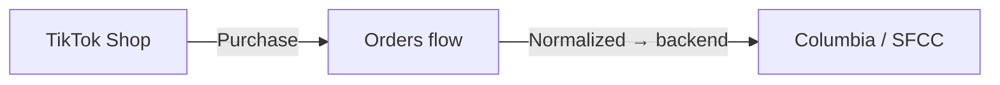
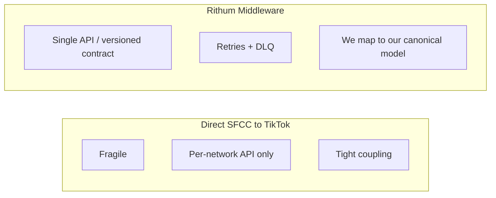
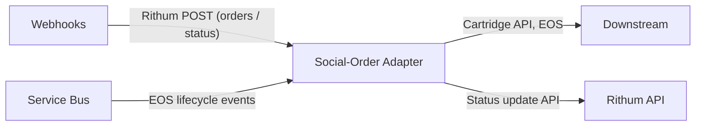
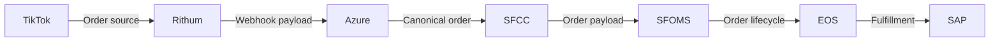
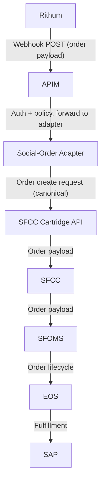
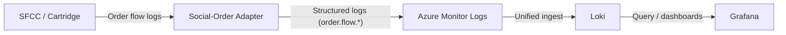
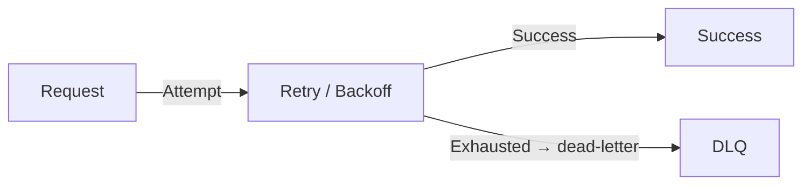
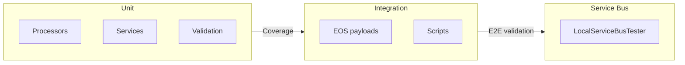
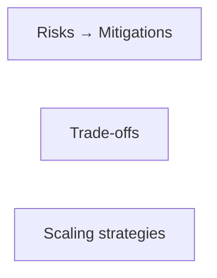

# Social-Order Adapter

## High‑Reliability Real‑Time System Design

### Client: Columbia Sportswear

### Project: Social‑Order Adapter

#### Brandon Pliska — Principal Engineer Candidate

---

## Slide 2 — Presentation Structure (RADIO + STAR)

**Two main threads:**

- **System design (RADIO)** — Requirements, Architecture, Data model, Interface, Optimizations.
- **Leadership & outcomes** — How I led design, coordinated teams (commerce, SAP, SFCC/SFOMS, Rithum), delivered via pipelines; STAR: impact, risks/trade-offs, reflections.

---

## Slide 3 – Problem Domain & Objectives (RADIO: R)

Columbia needed to support **multiple social networks** for in-app commerce; **TikTok Shop** was first. Orders had to flow reliably into Columbia’s systems.

**Objectives:**

- **Robust pipeline** — Normalize TikTok order data; handle bursty, inconsistent payloads without breaking downstream.
- **Timely data** — Orders, cancellations, and updates in time for fulfillment, inventory, and support.
- **Predictable behavior** — Handle malformed, partial, or delayed payloads while preserving order integrity and provenance.

---

## Slide 4 — Requirements (RADIO: R — Functional & Non-Functional)

**Functional:** Ingest TikTok orders via Rithum → adapter webhooks; map to **our canonical format**; SFCC Cartridge API to create orders. Normalize for SFCC/SFOMS and **EOS (Columbia’s enterprise order service and source of truth for order lifecycle on the Columbia side)**, then SAP. Full **provenance**; **bidirectional** status (webhooks in; EOS → Service Bus → Adapter → Rithum API back). Auth via APIM; Azure Service Bus for upstream sync and audit.

**Non-functional:** Reliable, observable, maintainable; scale under spikes; auditable.

---

## Slide 5 — Key Technology Decision: Why Rithum (RADIO: R → A)

**Direct SFCC → TikTok:** Fragile; per-platform API; no single schema; no retries; tight coupling.

**Rithum middleware:** Single integration for TikTok (and future networks); **we defined our canonical data model**—Rithum’s API is an external contract we map to/from (schema never leaks in). Rithum handles PII/social-account protection at the boundary. Retries + DLQ; future-proof (Instagram, YouTube); versioned contracts; ADR-documented.

---

## Slide 6 — High‑Level Architecture (RADIO: A)

---

## Slide 7 — Backend, Scaling & Deployment (RADIO: A + O)

**Auto-scaling:** Azure Function Apps scale with load; handle spikes without over-provisioning.

**Single adapter (one Function App):** The Social-Order Adapter is the **bridge and boundary** between Rithum and Columbia’s SFCC/SFOMS/EOS systems. **Downstream** — Rithum webhooks → APIM → adapter → SFCC Cartridge → orders in Columbia. **Upstream** — EOS/SAP lifecycle events → Service Bus → adapter → Rithum API. One app for both; scales for webhook and Service Bus traffic.

---

## Slide 8 — Data Model: Provenance & Canonical Mapping (RADIO: D)

- **Canonical model** — Order, line items, status defined once; normalized for SFCC, SFOMS, EOS, SAP. Rithum’s schema is an external contract we map to/from (volatility stays at boundary).
- **Provenance chain** — TikTok → Rithum → Azure → SFCC/SFOMS → EOS → SAP.
- **Structured logging** — e.g. `order.flow.webhook.paymentcleared.received`, `order.flow.sfcc.create.request`, `order.flow.servicebus.eosorderupdate.received`, `order.flow.rithum.updatestatus.request`.

---

## Slide 9 — Interface: Downstream Order Creation (RADIO: I)

**Flow:** Rithum posts to adapter webhooks (e.g. payment cleared) → APIM auth → Adapter validates, maps to canonical format → SFCC Cartridge API → SFCC/SFOMS → EOS (Columbia’s order-lifecycle source of truth) → SAP. Upstream status sync is Slide 10.

---

## Slide 10 — Interface: Upstream Status Sync (RADIO: I)

**Flow:** EOS holds lifecycle state; when SAP fulfills or cancels/refunds, EOS publishes to Service Bus → Adapter consumes, maps to Rithum semantics → Rithum API → TikTok updated.

**Interfaces:** EOS/SAP → Service Bus; Service Bus → Adapter; Adapter → Rithum API (status update).

---

## Slide 11 — Observability: Grafana + Loki (RADIO: O)

**Why Loki:** KQL was resource-scoped and hard to correlate. Loki unifies logs across Columbia (AWS, GCP, Salesforce, Azure); we follow one order end-to-end. Grafana = single pane; structured logging for provenance queries.

**Flow:** Adapter (and Azure) → Azure Monitor Logs → Loki → Grafana.

---

## Slide 12 — Key Challenges & Mitigations (RADIO: O) (Action)

**Scaling** — Functions auto-scale; Service Bus buffers upstream status; no over-provision or dropped messages.

**Data sync** — Canonical model + mapping layer + idempotent order creation; provenance for reconciliation.

**Security** — APIM at edge; no TikTok credentials in our stack; least-privilege; Rithum holds social/PII at boundary.

**Fault tolerance** — Retry + backoff; DLQ for failures; idempotent creates; health checks and circuit breakers; stateless.

---

## Slide 13 — Deployment Model (RADIO: O)

- **Pipelines** — Azure DevOps: build, test, release (Adapter, Service Bus, APIM); config in repo (dev, perf, prod).
- **Stateless functions** — Scale out without session affinity.
- **APIM** — All external traffic through APIM; auth and policy in one place.
- **Canary** — Roll out to subset, then full.
- **Rollback** — Auto-revert to last known good on failure.

---

## Slide 14 — QA and Testing (RADIO: O)

**Unit (MSTest, .NET 8):** Processors (OrderProcessor, ReturnOrderProcessor, ShipmentProcessor) and services (EOS, OrderTransformationService, etc.) with Moq/FluentAssertions; HTTP mocked; JSON testdata. Coverage: coverlet + ReportGenerator.

**Validation:** ValidationService — order, contact, address, items; allowlisted statuses and order types; structured ValidationResult.

**Integration & Service Bus:** Golden payload + Postman for Rithum discovery and SFCC Cartridge development; scripts and EOS payloads; LocalServiceBusTester and servicebus-test-payloads for E2E.

**Outcome:** Unit guards mapping and boundaries; integration + Service Bus validate flows; canary and rollback (Slide 13) reduce risk.

---

## Slide 15 — Cross-Functional Integration (RADIO: I + O)

- **Auth** — APIM for webhooks; API keys/policies; no customer SSO (TikTok/Columbia handle identity).
- **APIs** — Versioned Rithum and cartridge contracts; clear request/response and errors.
- **Reproducibility** — Git, ADRs, release tags, deployment automation.
- **Consistency** — Canonical model, idempotency, provenance (Slides 8, 12); observability: Loki, Grafana, correlation IDs (Slide 11).
- **Systems** — Rithum, TikTok, SFCC/SFOMS, EOS, SAP; order and status flow only.

---

## Slide 16 — Team Leadership & Delivery (Action)

- **Discovery** — Scoped problem, evaluated direct vs Rithum, shaped technical direction.
- **Rithum adoption** — PoC and evidence so the org could commit to Rithum.
- **Buy-in** — Aligned stakeholders on adapter tech, hosting (Azure), and patterns; built the “Columbia way” to speed approval.
- **Design & delivery** — Drove canonical data model and single adapter; ADRs; coordinated commerce, SAP, SFCC/SFOMS, Rithum on contracts and rollout; Azure DevOps with canary and rollback.

---

## Slide 17 — Risks, Trade‑Offs & Scaling (RADIO: O)

**Risks:** API changes → versioned contracts, adapter abstraction, drift monitoring. Traffic spikes → auto-scale + Service Bus + DLQ. Data inconsistency → idempotency, provenance, structured logs.

**Trade-offs:** Latency vs accuracy (normalize/validate first). Streaming (webhooks + Service Bus; no batch ETL). Coupling (canonical model + one adapter). Observability cost (retention/sampling).

**Scaling:** Horizontal (stateless functions); buffering (Service Bus + retries/DLQ); new channels (same model → minimal adapter change).

---

## Slide 18 — Impact & Reflections (Result)

**Technical:** Reliable, scalable pipeline; full provenance TikTok → SAP → TikTok; faster debugging (Grafana/LogQL); less operational overhead.

**Organizational:** New channels (e.g. Instagram) with minimal work; clearer ownership (Columbia, Rithum, SFCC/SFOMS, SAP).

**Reflections:** Canonical model + one adapter paid off; Rithum as mapped external contract isolated schema churn; early observability made incidents and contract issues easier to fix.

---

## Slide 19 — Closing

I build high‑reliability, real‑time systems: clear requirements and architecture, a canonical data model that keeps integration volatility at the boundary, and observability that turns incidents into fast fixes. I led that design and delivery across Columbia, Rithum, SFCC, and SAP.

I’d bring the same discipline—requirements‑driven design, maintainable boundaries, and operational clarity—to Columbia’s mission‑critical systems.

---

## Slide 20 — Thank You

Thank you for your time and consideration.  
I look forward to the possibility of contributing to the team.
