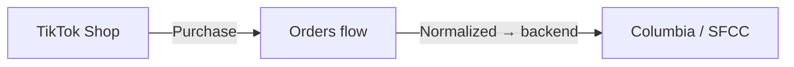
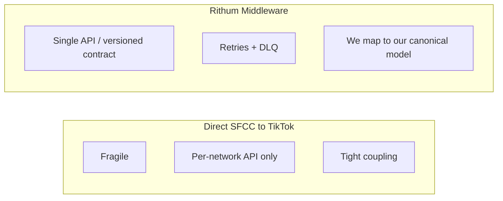
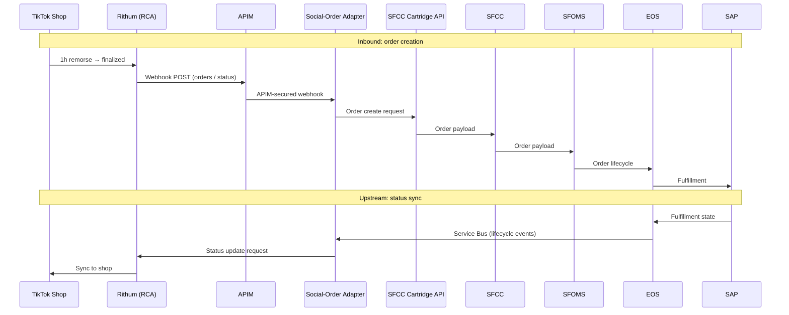
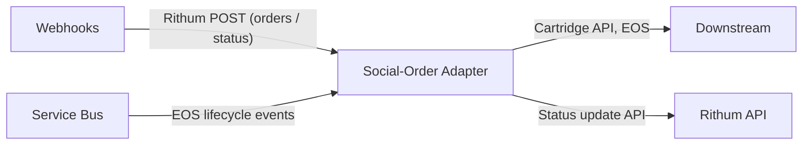
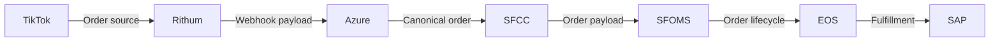
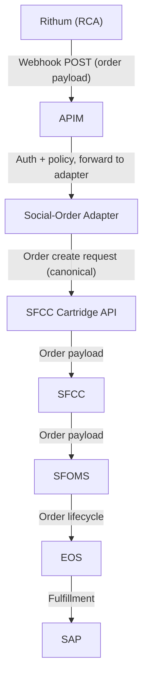
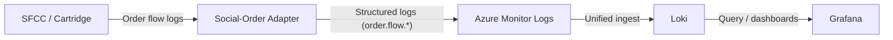
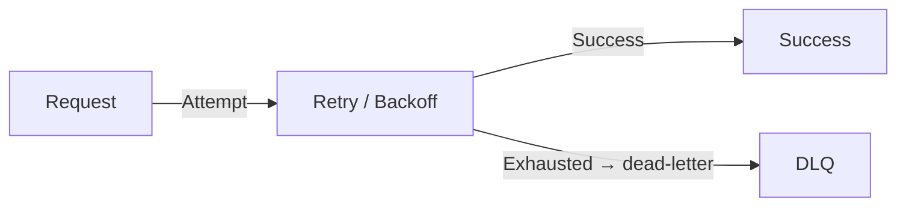
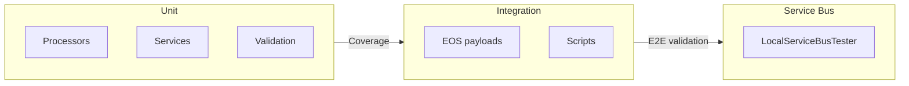
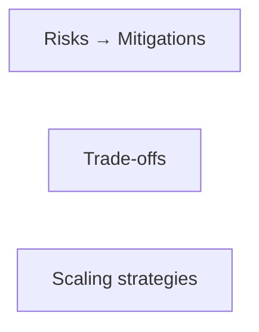

# Social-Order Adapter

## High‑Reliability Real‑Time System Design

### Client: Columbia Sportswear

### Project: Social‑Order Adapter

###

#### Brandon Pliska — Senior Full Stack Engineer Candidate

---

## Slide 2 — Presentation Structure (RADIO + STAR)

**Two main threads:**

- **System design** — How we built it:
  - **R**equirements — What we had to do and why.
  - **A**rchitecture — Main pieces (Rithum, API gateway, Adapter, message bus, Columbia’s commerce systems) and how they connect.
  - **D**ata model — How we defined orders and tracked them end-to-end.
  - **I**nterface — How systems talk (webhooks, APIs).
  - **O**ptimizations — Scaling, monitoring, and staying reliable.
- **Leadership** — How I led design, aligned teams, and shipped via pipelines.
- **Outcomes** — What we achieved and what we’d do differently.

---

## Slide 3 – Problem Domain & Objectives (RADIO: R — Requirements)

Columbia wanted to sell on **multiple social apps**; **TikTok Shop** was first. Customers buy inside TikTok; those orders had to reach Columbia’s systems reliably.

### Objectives

- **Robust pipeline** — Turn TikTok orders into a consistent format and handle messy or bursty data without breaking anything.
- **Timely data** — Get orders, cancellations, and updates to fulfillment and support quickly.
- **Predictable behavior** — Handle bad or late data without losing orders or breaking the chain.

---

## Slide 4 — Requirements (RADIO: R — Functional & Non-Functional)

**What the system must do**

- **Bring in TikTok orders** — A partner (Rithum) sends orders to our adapter; we convert them to our format and create orders in Columbia’s commerce system.
- **One format everywhere** — Same order shape for Columbia’s commerce, order service, and SAP. Orders move: New → Authorized → Confirmed → Shipped → Fulfilled.
- **Full history** — We can trace every order from TikTok to SAP.
- **Two-way updates** — Orders flow in; status (shipped, cancelled, etc.) flows back to TikTok.
- **Secure** — All external traffic goes through an API gateway (APIM).
- **Message bus** — We use Azure Service Bus to send status back to the partner and for auditing.

**How it should behave**

- Reliable, observable, easy to maintain.
- Handles traffic spikes.
- Auditable across systems.

---

## Slide 5 — Key Technology Decision: Why Rithum (RADIO: R → A)

We compared two approaches:

**Columbia talks to TikTok directly**

- Brittle and high maintenance.
- Each platform has its own API; no single format.
- No built-in retries; tight coupling.

**Use Rithum in the middle**

- One integration for TikTok (and future platforms).
- We defined **our own** order format; Rithum’s format stays at the boundary.
- **Security and PII** — Rithum handles **protection of social media accounts** and related data at the boundary, so we didn’t have to store or secure social credentials in our stack.
- Retries and dead-letter queues built in.
- Ready for Instagram, YouTube, etc.
- Decision documented in an ADR.

---

## Slide 6 — High‑Level Architecture (RADIO: A — Architecture)

---

## Slide 7 — Backend, Scaling & Deployment (RADIO: A — Architecture)

**Auto-Scaling**

- Azure Functions scale with load, so we handle spikes without over-provisioning.

**One adapter for both directions**

- **Inbound:** Partner sends orders and status to our webhooks; we create orders in Columbia’s system and update status. API gateway handles auth.
- **Outbound:** When Columbia ships or cancels, events go to a message bus; the same app reads them and tells the partner so TikTok stays in sync.

Result: one app that takes orders in and sends status back, and it scales for both.

---

## Slide 8 — Data Model: Provenance & Canonical Mapping (RADIO: D)

- **Our data model** — We defined orders, line items, and status once. Columbia’s systems and SAP use that. The partner’s format is only at the boundary; we map to/from it.
- **Provenance** — We can trace each order: TikTok → partner → Azure → Columbia commerce → order service → SAP.
- **Structured logs** — We use consistent names (e.g. order.flow.webhook.received, order.flow.sfcc.create.request) so we can search and debug easily.

---

## Slide 9 — Interface: Downstream Order Creation (RADIO: I)

**Flow**

- Partner posts new orders to our webhook (e.g. when payment clears).
- API gateway checks auth and forwards to the adapter.
- Adapter converts to our format and calls Columbia’s API to create the order.
- Columbia’s commerce and order service handle lifecycle; SAP handles fulfillment.

**In short:** Partner webhook → Adapter → Columbia order API → commerce → order service → SAP.

---

## Slide 10 — Interface: Upstream Status Sync (RADIO: I)

**Flow**

- Columbia’s order service holds lifecycle state. When SAP ships (or cancels/refunds), events go to the message bus.
- Our adapter reads those events, maps status to the partner’s format, and calls the partner’s API so TikTok shows the right state.

**In short:** SAP / order service → message bus → Adapter → partner API → TikTok.

---

## Slide 11 — Observability: Grafana + Loki / KQL (RADIO: O)

**Why we used Loki**

- Existing tools were per-system and hard to correlate.
- Loki gives one place for logs across Columbia (AWS, GCP, Salesforce, Azure). We can follow one order across systems.
- Grafana dashboards give a single view.
- Structured logging made it easy to query and debug.

**Flow:** Adapter (and Azure) send logs to Azure Monitor → Loki → we query and build dashboards in Grafana.

---

## Slide 12 — How We Approached Key Challenges (RADIO: O) (Action)

**Scaling** — Functions auto-scale; the message bus buffers status updates so we don’t drop messages or over-provision.

**Keeping data in sync** — Orders flow in; status flows back. One data model and one adapter, with idempotent order creation, keep everything consistent. We can trace and reconcile via provenance.

**Security** — One secure entry point (API gateway); auth at the edge; no raw TikTok credentials in our stack; minimal permissions for adapter calls. **PII security was considered**; Rithum’s handling of social account protection kept that data out of our domain.

**Fault tolerance** — Retries with backoff; failed messages go to a dead-letter queue; idempotent creates avoid duplicates; health checks and circuit breakers; stateless so failures don’t leave bad state.

---

## Slide 13 — Deployment Model (RADIO: O)

- **Pipelines** — Build, test, and release (adapter, message bus, API gateway) are automated in Azure DevOps. Config lives in the repo.
- **Stateless functions** — Scale out without sticky sessions.
- **API gateway** — All external traffic goes through it; one place for auth and policy.
- **Canary** — Roll out to a small set first, then full rollout.
- **Rollback** — Automatically revert to last good release if something fails.

---

## Slide 14 — QA and Testing

We tested in layers so the adapter behaves predictably with real and test data.

**Unit tests**

- Processors and services with mocks; real-looking JSON for orders and returns. We check success paths, errors, and edge cases.
- Coverage tracked; test data included in build for file-based tests.

**Validation**

- We validate orders, contact info, addresses, and items. We allowlist valid statuses and order types and return clear errors.

**Integration and message bus**

- **Golden payload in Postman** — We used a **golden payload** (one canonical sample) in **Postman** for **Rithum discovery** (webhook shape, auth) and **SFCC Cartridge development** (order-create requests); same sample for exploration and tests.
- Scripts and test payloads for end-to-end flows. A local tester app and payloads drive the processors against real queues.

**Result** — Unit tests protect mapping and boundaries; integration and message-bus tests validate flows before release; canary and rollback reduce risk.

---

## Slide 15 — Cross-Functional Integration (RADIO: I + O)

- **Auth** — API gateway for partner webhooks; API keys and policies. No customer login in this pipeline.
- **APIs** — Versioned contracts for partner webhook and partner API; clear request/response and errors for Columbia’s cartridge.
- **Reproducibility** — Code in Git; ADRs for big decisions; tagged releases and automated deploy.
- **Consistency** — One data model, idempotent creates, and full provenance for reconciliation and debugging.
- **Observability** — One log store (Loki), Grafana, structured logs, and correlation IDs across the full path.
- **Systems involved** — Partner (orders + status), TikTok (source of orders), Columbia commerce and order service, SAP (fulfillment). No file storage or push notifications; only order and status flow.

---

## Slide 16 — Team Leadership & Delivery (Action)

- **Discovery** — I owned scoping, option evaluation (direct vs Rithum), and technical direction before build.
- **Rithum adoption** — I led proof-of-concept and evidence so the org could commit to Rithum with confidence.
- **Buy-in** — I aligned stakeholders on adapter tech, hosting (e.g. Azure), and patterns. I built it the “Columbia way” to speed approval.
- **Design and delivery** — I drove the single data model and one adapter; wrote ADRs; coordinated with e-commerce department, SAP, and the partner on contracts and rollout; used Azure DevOps with canary and rollback so we could ship safely.

---

## Slide 17 — Risks, Trade‑Offs & Scaling Strategies (RADIO: O)

**Risks and what we did**

- **Partner or TikTok API changes** — Versioned contracts, adapter in the middle, and monitoring for drift.
- **Traffic spikes** — Auto-scaling and message bus to buffer; dead-letter for failures.
- **Data inconsistency** — Idempotency, provenance, and structured logs for audit and reconciliation.

**Trade-offs**

- **Latency vs accuracy** — We accept a short delay to normalize and validate instead of pushing raw payloads.
- **Streaming** — We use events (webhooks + message bus) for speed; no batch ETL in the hot path.
- **Coupling** — One data model and one adapter to keep things maintainable as we add channels.
- **Observability cost** — We use structured logs and Loki for depth; we control cost with retention and sampling.

**Scaling**

- **Horizontal** — Stateless functions scale out with load.
- **Buffering** — Message bus absorbs spikes; retries and dead-letter prevent loss and allow replay.
- **New channels** — Same data model and mapping mean new platforms (e.g. Instagram) need minimal adapter change.

---

## Slide 18 — Impact & Reflections (Result)

- **Technical** — Reliable, scalable pipeline; full order trail TikTok → SAP → TikTok; faster debugging with Loki; less operational overhead.
- **Organizational** — New channels (e.g. Instagram) can be added with less work; clearer ownership between Columbia, partner, and SAP.
- **Reflections** — One data model and one adapter paid off. Keeping the partner as an external contract we map to kept schema churn isolated. Investing in observability early made incidents and contract issues easier to fix.

---

## Slide 19 — Closing

I build systems that perform under real‑world constraints.  
I'd bring the same rigor, clarity, and reliability to Echodyne's radar software platform.

---

## Slide 20 — Thank You

Thank you for your time and consideration.  
I look forward to the possibility of contributing to Echodyne.
